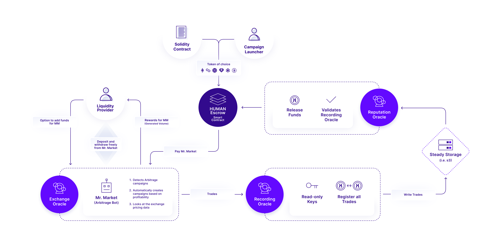

# Hu Fi

## What is Hu Fi


The crypto markets are characterized by their fragmented markets, where each cryptocurrency product on every exchange often requires its own market-making. Some products are quoted in USD, USDC, USDT, or even foreign currencies. In essence, each crypto exchange has an isolated order book for each trading pair. In addition, derivative and future products are also disjointed.  This differs from traditional markets, which have regulated, centralized market-making where the futures markets are well hedged. In the crypto sector, each product must manage its market-making independently in a one-off manner on each exchange it launches on.  Market making is a lucrative industry but it’s currently only available to the largest crypto actors and the average crypto user has no way to participate. Projects create one off agreements between market makers potentially with a subset of the exchanges they trade on. Recently DeFi markets have allowed for some programmatic market making directly from solidity but they represent a tiny fraction of the overall crypto market.

HuFi introduces a decentralized approach to market-making, enabling anyone with tokens and code to programmatically engage in market-making on any centralized exchange using Solidity. The code for market-making can be directly embedded in the crypto product itself, or externally with a sidecar market-making product. Additionally, anyone with exchange keys and the ability to run a bot can now become a market maker safely and transparently. Finally, anyone with excess crypto funds can earn income by providing it to the bot to generate yield on this excess crypto. 

HuFi utilizes the Human Protocol to ensure fair compensation for market makers. By leveraging the same smart contract framework and infrastructure already in use for various applications, including machine learning, market makers can trust that they will receive timely and fair payment. This trust is reinforced by the use of the same Escrow Factories, which have a proven track record of reliably disbursing payments to individuals involved in machine learning labeling tasks for years.

## Services
- [Campaign Launcher](./campaign-launcher)
  
  Campaign launcher launches market making campaigns.
- [Mr.Market](https://github.com/Hu-Fi/Mr.Market)
  
  Mr.Market is a trading bot, that is contributing to the market making campaigns. Users can contribute to Mr.Market itself by providing liquidity, so that they can be rewarded the portion of rewards that Mr.Market makes.
- [Recording oracle](./recording-oracle)
  
  Recording oracle keeps track of the activities for the campaigns(trading, making orders, etc.).
- [Reputation oracle](./reputation-oracle)
  
  Reputation oracle calculates the score of each user involved in the campaign, and distributes the campaign fund.

## Development

### Prerequisites
- [Docker](https://docs.docker.com/engine/install/)
- [Node.js (*v18 is recommended*)](https://nodejs.org/en/download/package-manager) 
- [Yarn](https://classic.yarnpkg.com/lang/en/docs/install/)

### All in one go
1. Install all dependencies
    ```bash
    $ make install
    ```

2. Create environment files
    ```bash
    $ make create-env-files
    ```

3. Start development servers
    ```bash
    $ make start
    ```

### Individual services
Please refer to README of individual services.
